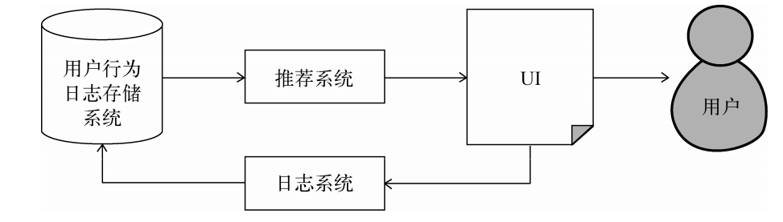

# 推荐系统

## 简介

*主要内容：什么是推荐系统？推荐系统的应用、系统基本组成*

### 什么是推荐系统

联系用户和信息： 通过对用户历史行为和偏好进行分析，帮助用户发现对自己有价值的信息，
同时让信息展现在对它感兴趣的人面前的一种系统

                           推荐系统
用户(information overload)   《=》    信息

历史行为 兴趣建模

**应用领域**

*    电商: 淘宝、亚马逊
*    在线视频: Netflix、YouTube、抖音
*    音频: QQ音乐、豆瓣
*    社交：微信、Facebook
*    文学：豆瓣读书
*    广告：Google、微信、今日头条

### 评价指标

* 用户满意度
  
  通过用户调查，线上反馈，购买率或者用户点击率，停留时间等方式统计

* 准确率

  通过离线实验计算

* 覆盖率

  离线计算获得
  
* 多样性
* 新颖性
* 惊喜度
* 信任度
* 实时性
* 健壮性

### 实验方法

#### 离线实验
1.   通过日志系统获得用户行为数据，并按照一定格式生成一个标准的数据集；
1.   将数据集按照一定的规则分成训练集和测试集；
1.   在训练集上训练用户兴趣模型，在测试集上进行预测；
1.   通过事先定义的离线指标评测算法在测试集上的预测结果。

#### 在线实验
在线测试，通过AB测试，测评算法的指标

#### 用户调查
对于一些无法定量计算的指标，需要通过用户调查进行测评

--------

## 利用用户行为数据

### 用户行为数据采集

用户行为数据收集：日志系统

显性反馈行为： 评级，评分系统
隐形反馈行为：浏览记录，通常是一些日志记录

### 用户行为分析

长尾分布

物品流行度：物品产生过行为的用户总数，越流行，用户数量越大
用户的活跃度：用户产生过行为的物品总数，越活跃，浏览的物品数越多

仅仅基于用户行为数据设计的推荐算法一般称为协同过滤算法，
包括：基于邻域的方法（neighborhood-based）、 隐语义模型
（latent factor model）、 基于图的随机游走算法（random walk on graph）

### 基于邻域的算法

#### 基于用户的协同过滤算法

1.   找到和目标用户兴趣相似的用户集合
1.   找到这个集合中的用户喜欢的，且目标用户没有听说过的物品推荐给目标用户

#### 基于物品的协同过滤算法

1.   算物品之间的相似度。
1.   根据物品的相似度和用户的历史行为给用户生成推荐列表。

### 隐语义模型

基于分类实现

1.   如何给物品进行分类？
1.   如何确定用户对哪些类的物品感兴趣，以及感兴趣的程度？
1.   对于一个给定的类，选择哪些属于这个类的物品推荐给用户，以及如何确定这些物品在
     一个类中的权重？

### 基于图的模型

给用户u推荐物品的任务就可以转化为度量用户顶点
vu和与vu没有边直接相连的物品节点在图上的相关性，相关性越高的物品在推荐列表中的权重就
越高。

## 推荐系统冷启动问题

解决早刚开始没有用户数据时，如何作个性化推荐

## 利用用户标签数据

标签系统中的推荐问题主要有以下两个。
 如何利用用户打标签的行为为其推荐物品（基于标签的推荐）？
 如何在用户给物品打标签时为其推荐适合该物品的标签（标签推荐）？
为了研究上面的两个问题，我们首先需要解答下面3个问题。
 用户为什么要打标签？
 用户怎么打标签？
 用户打什么样的标签？

## 利用上下文信息

加入一些其他因子：时间，地点等等

## 利用社交数据

## 实例

## 评分预测方法