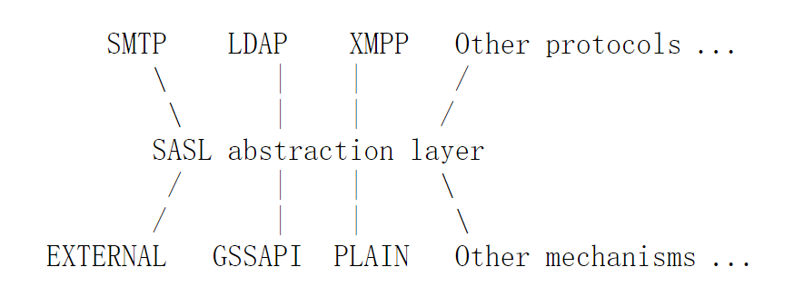
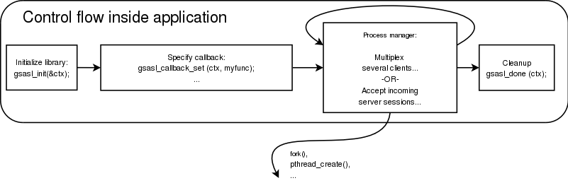
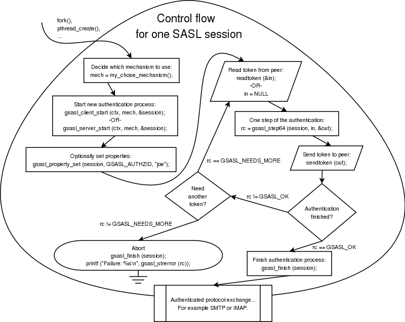

# SASL 

## 概述 

SASL是一种认证框架，解耦了应用和底层认证机制，为应用提供了统一的认证方案，同时提供数据完整性和安全性服务。

SASL框架认证流程：

1.  客户端请求认证；
1.  服务端列出支持的认证机制；
1.  客户端确认使用哪一种认证机制；
1.  服务端质询
1.  客户端应答
1.  ...
1.  认证成功或者失败

## 实现

[GNU SASL](https://www.gnu.org/software/gsasl/)

### 应用模型

