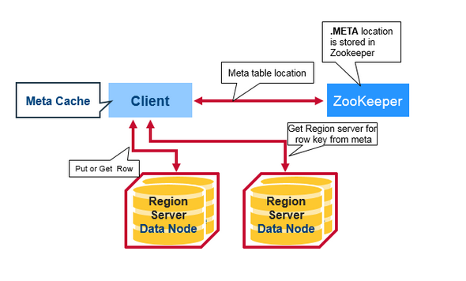
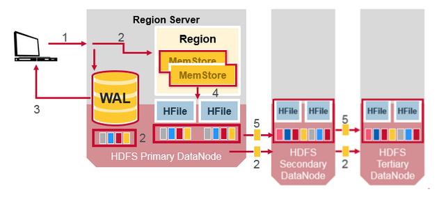
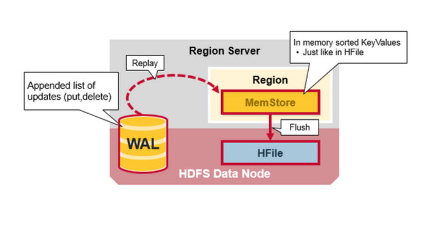

# hbase入门

## 概述 

分布式NoSQL数据库，Hadoop数据存储组件，支持随机（可以单独访问任意一行的某一列）、实时读写数据，支持上千节点的集群，管理PB级数据，
单表支持**billions of rows X millions of columns**，是Google BigTable的开源实现，BigTable使用GFS作为底层存储，类似的，
hbase使用HDFS（Hadoop File System，GFS的开源实现）作为底层存储。
系统架构：

整个hbase由三部分组件构成：**HMaster、Region Server、Zookeeper**

*   **HMaster**，负责DDL（表创建、删除等）操作，Region分配，HMaster在集群中主备部署，提高可用性；
*   **Region Server**，直接和用户通信，响应用户进行读写请求，负责数据的读写;
*   **Zookeeper**，通用的集群高可用组件，负责集群的健康检查，保持集群处于可用状态；
*   图中的NameNode和DataNode是HDFS的组件，分别负责元数据和存储实际数据，属于hbase的底层存储

## 数据模型

在hbase中数据被保存在表中，逻辑上由行和列构成，但实际上hbase是一个多维map，数据由: rowkey -> cf -> qualifier -> value的形式访问。

**表**

表由行和列构成，可以随机访问表中任意行的任意列

**行**

行由rowkey和列组成，rowkey是行的索引，是一个字符串，通常是将域名反转，例如：*org.apache.www*，
行在实际存储的时候，会对rowkey进行hash，rowkey相关的行会被存储在一起，以提高查询效率，例如：*org.apache.xxx*
的行会存储在一起，而*com.baidu.xxx*的行会存储在一起，不
出现*org.apache.xxx*的行和*com.baidu.xxx*的行交错存储

**列**

列由column family和column qualifier组成，中间由":"作为分割符，例如：user:name

**column family**

由一系列的列组成，可以对column family定义存储属性，以提高查询性能，例如，对如一些经常查询的column family，
可以设置将其缓存在数据库中。

**column qualifier**

相当于列名

**cell**

数据的实际存储单元，由（table，rowkey，column family：column qualifier）三元组定址，一个cell可以存储数据的多个数据版本，
每个数据有个隐藏的timestamp，默认存储三个历史版本（也可配置存储更多的数据版本），例如对同一个cell进行三次put操作，其值的变化
过程为：（value1，timestamp1）->(value2, timestamp2)->(value3, timestamp3)，查询时默认返还最新版本的value

**namespace**

namespace是一系列相关表的逻辑分组，可以使用namespace对表进行安全管理。hbase中有两个默认的namespace，分别是：hbase和default，
hbase命名空间中包含用于hbase系统管理的表，在创建表时，如果不指明命名空间，则属于default命名空间

## 数据操作

GET\PUT\DELETE\SCAN(用于一次查询多行)

## 数据读写过程

HBase中每一张表都会被水平分割成多个region，散布在多个region server中，hbase中用META表记录每一个region对应的region_server
信息，key为（table_name, rowkey），value为region server，META表的位置信息位于zookeeper中，
用户获得region server后，直接后region server交互，然后缓存region 
server信息，直到在region server上查询不命中，才再次发起region server查询。 详细过程如下：

1.  用户从zookeeper中获取META表所在的region server；

1.  用户向META表所在的region server发起查询，获得用户想要访问的rowkey所在的region server，并缓存该region server

1.  用户访问rowkey对应的region server

## 性能

*	读写分离，读写均支持缓存

	
	
* 	表会被自动按行拆分成region，分布在多个region server中，有助于负载均衡和提升并发量

	

## 可靠性

*	分布式存储，数据多副本、跨节点备份

	
	
* 	zookeeper提供协调服务，实现集群健康管理、故障恢复、HMaster主备备份

	
	

* 	通过wal功能，支持故障后，对未持久化的数据进行恢复

	
	
## 可扩展性

hdfs提供底层存储服务，具有极高扩展性，通过水平扩展服务器，可以获得容量和性能的提升

## 用户案例

Facebook、 twitter、 yahoo（文件指纹） 、阿里

## 参考连接 

1.	*[https://hbase.apache.org/book.html](https://hbase.apache.org/book.html)*

1.	*[https://mapr.com/blog/in-depth-look-hbase-architecture/](https://mapr.com/blog/in-depth-look-hbase-architecture/)*