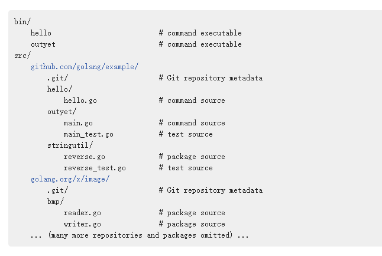
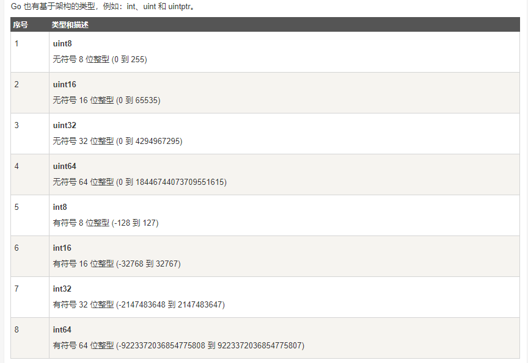
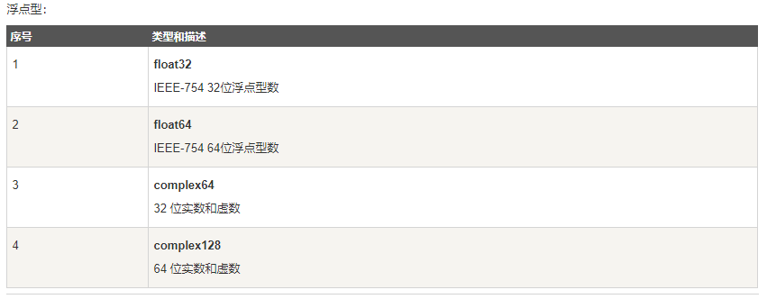
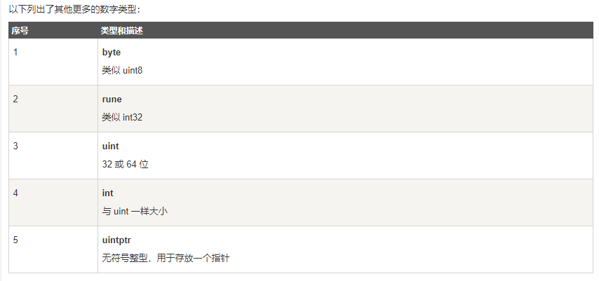

# go学习笔记

## go的工作区

go的工作区即存放go代码的目录，用go开发项目都是统一放到工作区目录下，配置go提供的
工具，进行编译、构建。

go的工作区由环境变量GOPATH指定，默认的工作区为“$HOME/go”，可以通过修改GOPATH变量
修改工作区，**修改后，记得使用export导出，否则不生效**


### go工作区的目录结构

go的工作区从上到下分为workplace、repository、package，其中workplace相当于根目录，
可以包含多个repository，每个repository可以包含多个package，直接包含go源代码的目录，
则为package

一个workplace下，只包含bin和src目录，其中bin中包含由go工具生成的可执行文件，如图所示



代码的结构按照go的工作区规则部署，就可以使用go install, build等工具，进行构建

## Import Path

import关键字用于从指定的目录下（可以是本地，也可以是远程的），导入其他package，供程序
使用，i.e: import zhangchen.com/my/func_lib，用于导入$GOPATH/src/zhangchen.com/my/func_lib
下的func_lib包，可执行程序所在的包名一定是main，程序的入口为main包中的main函数

使用import导入某个包时，会执行该包下所有文件中的init函数，**如果只想执行某个package下的init
函数，则可以在import关键字后加 "_"。 **

## 包

go程序以包为单位组织程序，包是最小的编译单元。程序的执行入口为main包的main函数，其他包在编译时
只会生成对象文件。

### 包中标识符的可见性

*	以大写字母开头的标识符（变量、常量、类型、函数等等），能够别外部的包所引用，相当于public；
*	以小写字母开头的标识符（变量、常量、类型、函数等等），只在包内可见，相当于private；

--------

## go语法

### 变量

1.	变量的申明

	go是一种强类型语言，因此在申明变量时，需要指定变量类型，也不允许不同类型之间的变量相互赋值，
	使用**var**关键字声明变量，格式为**var name type = initialvalue**，e.g:
	```go
	var age int = 3
	```
	对于没有初始值的变量，go会自动赋值成“0值”，go具有**类型推断**特性，对于**有初始值**的变量，go能
	自动推断类型，在申明的时候，可以省略变量类型，e.g:
	```go
	var age = 3 //age为int类型
	```
	可以一条语句声明多个变量，e.g:
	```go
	var age, name = 13, "zhangsan"
	```
	也可以同时包含初始化，和初始化的变量，e.g:
	```go
	var (
		age = 13
		name = zhangsan
		height int
	)
	```
	
	**简短申明**
	
	使用**:=**，来完成变量的声明和初始化，但是必须满足下面两个条件：
	
	*	:= 操作符左边的所有变量都必须有初始值，否则抛出异常
	*	:= 操作符左边的变量，全部会被当作新的变量，且会覆盖同名的变量
		
		````go
		func add(a, b uint32) (bool, uint32) {
			return true, a + b
		}

		func main() {
			var a uint32
			//“:=”会将左边的变量当作新的变量，if中表达式中的变量作用于整个if-else， 且覆盖外层变量
			if e, a := add(1, 2); !e {
				fmt.Println("a: ", a)
			} else {
				fmt.Println("a: ", a)
				if true {
					fmt.Println("a in else-if: ", a)
				}
			}
			fmt.Println("a: ", a)
		}
		
		//输出
		
		a:  3
		a in else-if:  3
		a:  0
		````
	
	*	只能在函数内部
	
1.	变量的作用域

	go只有两种作用域，包级作用域和函数级作用域。
	
1.	变量的生命周期
	
	包级作用域的变量，声明周期随进程，函数级作用域的生命周期直到没有引用，e.g:
	```go
	var global *int

	func f() {
		var x int
		x = 1
		global = &x
	}
	
	func g() {
		y := new(int)
		*y = 1
	}
	```
	
	变量global的生命周期随进程，注意**函数f中的变量x，在函数退出时，依然存在，因为通过global能够访问到他**，
	这种现象叫**变量逃逸**， 大量的变量逃逸，会阻止对短生命周期对象的垃圾回收，从而可能影响程序的性能，
	函数g中的变量y，在函数推出后，生命周期结束，所以go可以把该变量分配到栈上，虽然
	是通过new申明的，上面的例子说明，函数级变量的生命周期不一定随函数。
	
	go具有gc特性，不需要手动管理内存。
	
1.	数据类型

	go语言的数据类型可分为4大类：
	
	1.	**布尔型：**布尔型的值只可以是常量 true 或者 false。一个简单的例子：var b bool = true。
	
	2.	**数字类型：** 整型 int 和浮点型 float32、float64，Go 语言支持整型和浮点型数字，并且原生支持复数，其中位的运算采用补码。
	
		
		
		
		
	3.	**字符串类型：**字符串就是一串固定长度的字符连接起来的字符序列。Go的字符串是由单个字节连接起来的。Go语言的字符串的字节使用UTF-8编码标识Unicode文本。
	
	4.	**派生类型：**

		*	指针类型（Pointer）
		
		*	数组类型
		
			声明：var name [len]type
			```go
			var a [5]int
			
			//define and init
			var b = [5]int{1, 2, 3, 4, 5}
			
			//define and discard len
			var c = [...]int{1, 2, 3, 4, 5}
			```
			
		*	结构化类型(struct)
		
		*	Channel 类型
		
		*	函数类型
		
		*	切片类型
		
		*	接口类型（interface）
		
		*	Map 类型
	
--------

### 数组和切片

#### 数组

数组为固定长度的连续内存。

1.	申明

	```go
	var a [3]int //申明容量为3的数组，被填充全0
	var b [3]int = {1, 2, 3} //申明并初始化
	c := [3]int{1, 2, 3} //简短申明
	d := [3]int{1} //简短申明，部分初始化
	e := [...]int{1, 2, 3} //简短声明，由编译器决定长度
	```
	
1.	数组时值类型，赋值和传参都是拷贝

1.	数组的长度时固定的，可以由内置方法len获得

1.	使用range（返还index，value）遍历数组

	```go
	package main

	import "fmt"

	func main() {  
		a := [...]float64{67.7, 89.8, 21, 78}
		sum := float64(0)
		for i, v := range a {//range returns both the index and value
			fmt.Printf("%d the element of a is %.2f\n", i, v)
			sum += v
		}
		fmt.Println("\nsum of all elements of a",sum)
	}
	```
	
1.	多维数组

	```go
	package main

	import (  
		"fmt"
	)
	
	func printarray(a [3][2]string) {  
		for _, v1 := range a {
			for _, v2 := range v1 {
				fmt.Printf("%s ", v2)
			}
			fmt.Printf("\n")
		}
	}
	
	func main() {  
		a := [3][2]string{
			{"lion", "tiger"},
			{"cat", "dog"},
			{"pigeon", "peacock"}, //this comma is necessary. The compiler will complain if you omit this comma
		}
		printarray(a)
		var b [3][2]string
		b[0][0] = "apple"
		b[0][1] = "samsung"
		b[1][0] = "microsoft"
		b[1][1] = "google"
		b[2][0] = "AT&T"
		b[2][1] = "T-Mobile"
		fmt.Printf("\n")
		printarray(b)
	}
	```
	
#### 切片

切片时对数组的引用，本身时引用类型

1.	声明

	```go
	var a []int //一个空的切片
	var b [4]int = {1, 2, 3, 4}
	var c []int = b[1:3] //切片，从b[1,3)
	d := []int{1, 3, 4} //创建一个数组，并且返还其切片
	i := make([]int, 5, 5) //使用make创建切片，原型：func make([]T, len, cap) []T，  容量可选，默认等于长度
	```
	
1.	切片时引用类型，因此赋值和传参，都将会修改对应数据

1.	切片的长度和容量

	长度：切片中元素的个数，可以使用len函数获得
	
	容量：从切片的起始元素开始到其底层数组中的最后一个元素的个数，使用函数cap获得
	
1.	追加元素到切片，append， 原型：append(s []T, x ...T) []T

	到元素的个数，超过切片底层数组的容量时，切片会重新申请容量更大的数组（原数组容量的2倍）
	并且把原来的数组拷贝到新的数组，原来的数组由GC接管
	
	```go
	animal := []string{"dog", "cat"}
	
	append(animal, "duck"）
	
	fruit := []string{"apple", "orange"}
	
	append(animal, fruit...) //将fruit追加到animal
	```
	
1.	多维切片

	```go
	package main

	import (  
		"fmt"
	)
	
	
	func main() {  
		pls := [][]string {
				{"C", "C++"},
				{"JavaScript"},
				{"Go", "Rust"},
				}
		for _, v1 := range pls {
			for _, v2 := range v1 {
				fmt.Printf("%s ", v2)
			}
			fmt.Printf("\n")
		}
	}
	```

--------

### map

map为无序“key-value”，存储结构，底层实现为hash表

1.	声明
	
	```go
	var a map[string]string //一个空的map，在向其中添加数据前，需要使用初始化
	var a_init map[string]string{} //声明和初始化
	var b map[string]string = make(map[string]string)
	c := make(map[string]string)
	```
	
1.	添加、便利、删除数据

	```go
	a := make(map[string]string)
	
	a["hello1"] = "world1"
	a["hello2"] = "world2"
	a["hello3"] = "world3"
	
	for b := range a {
		fmt.println(a[b])
	}
	
	if v, ok = a["if_exist"]; ok {
		fmt.println(a["if_exist"])
	}
	
	delete(a, "hello3")
	
	```

--------

### 常量

在编译期间，就能确定的值，一旦定义就不能改变

定义：

const var [type] = value

带初始值的常量可以不定义类型，由类型自动推导完成

可以使用括号，一次定义多个常量，例如：

```go
const (
a1 int = 1
a2 int 
a3 = 1.1
)
```

#### 预定义常量

*	true
*	false
*	iota (初始值为0，每调用一次加1，知道遇到const关键字，被重新置0)

#### 枚举

go中的枚举通过const实现，例如：

```go
const (
    Monday = iota
    Tuesday
    Wednesday
    Thursday
    Friday
    Saturday
    Sunday
)
```

--------

### 程序流控制

1.	条件语句

	**if 语句**

	*	条件语句不需要使用括号将条件包含起来()；
	
	*	无论语句体内有几条语句，花括号{}都是必须存在的；
	
	*	左花括号{必须与if或者else处于同一行；
	
	*	在if之后，条件语句之前，可以添加变量初始化语句，使用;间隔；
	
	*	在有返回值的函数中，不允许将“最终的”return语句包含在if…else…结构中，否则会编译失败：
	
	```go
	func example(x int) int{
		var result int
		if x == 0 { 
			result = 5 
		} else { 
			result = x 
		} 
		return result
	}
	```
	
	**switch语句**
	
	*	左花括号{必须与switch处于同一行；
	*	条件表达式不限制为常量或者整数；
	*	单个case中，可以出现多个结果选项；
	*	Go语言不需要用break来明确退出一个case；
	*	只有在case中明确添加fallthrough关键字，才会继续执行紧跟的下一个case；
	*	可以不设定switch之后的条件表达式，在此种情况下，整个switch结构与多个if…else…的逻辑作用等同。
	
	```go
	switch { 
    case 0 <= Num && Num <= 3: 
        fmt.Printf("0-3") 
    case 4 <= Num && Num <= 6: 
        fmt.Printf("4-6") 
    case 7 <= Num && Num <= 9: 
        fmt.Printf("7-9")
	}
	```
	
1.	循环控制

	```go
	for i:=0; i < 10; i++ {
		fmt.Println(i)
	}
	
	sum := 10
	for {
		sum++
		if sum > 10｛
			break
		}
	}
	
	a := []int{1, 2, 3, 4, 5, 6}
	for i, j := 0, len(a) – 1; i < j; i, j = i + 1, j – 1 { 
		a[i], a[j] = a[j], a[i] 
	}
	```
	
	```go
	for j := 0; j < 5; j++ { 
		for i := 0; i < 10; i++ { 
			if i > 5 { 
				break JLoop 
			} 
			fmt.Println(i) 
		} 
	} 
	JLoop:
	```

--------

### 函数

函数的定义：

func func_name(parameters...) [return_type] { }

注意一下几点：

*	函数可以不返还值

*	函数可以返还值可以大于一个，可以使用“_”，忽略其中的返还值， 例如：
	```go
	func do_some (p int) (int, error) {
	}
	
	//接受全部返还值
	i, e = do_some(1);
	
	//忽略error
	i1, _ = do_some (2);
	```
--------
### 方法和接口

#### 方法

一个拥有receiver的函数，相当于面向对象的成员函数，其中receiver可以是基本型，也可以是自己定义的类型

定义：func (r ReceiverType) funcName(parameters) (results)

#### 接口

只定义方法名，而不实现方法

定义：

```go
type interfaceName interface {  
    //方法列表  
}  
```

接口也是一种类型，即实现了接口所定义方法的对象，支持将具体的对象赋值给
接口变量，或者在接口变量之间赋值，例如：

```go
type animal interface {
	speak()
}

type dog struct {
	//define someting...
}

type cat struct {
	//define someting...
}

func (d *dog) speak() {
	//do someting...
}

func (c *cat) speak() {
	//do someting...
}

//将对象赋值给接口
var i1 animal = new(dog);

//将接口变量赋值给接口
var i2 animal = i1;
```

将一个接口变量赋值给另一个接口变量，注意一下几点：

*	只要两个接口拥有相同的方法列表（与次序无关），即是两个相同的接口，可以相互赋值。
*	接口赋值只需要接口A的方法列表是接口B的子集（即假设接口A中定义的所有方法，都在接口B中有定义），
	那么B接口的实例可以赋值给A的对象，即子接口的对象，可以赋值给父对象。
	
**接口查询**

go支持查询接口变量对应的接收者类型，例如：

```go
package main
import "fmt"

type IPeople interface {
        GetName() string
 }

type IPeople2 interface {
        GetName() string
        GetAge() int
 }

type person struct {
        name string
}
func (p *person) GetName() string {
        return p.name
}
type person2 struct {
        name string
        age  int
}
func (p *person2) GetName() string {
        return p.name
}
func (p *person2) GetAge() int {
        return p.age
}
func main() {
        //p不可以转化为IPeople2接口，没有实现options.IPeople2接口中的GetAge()
        var p IPeople = &person{"jack"}
        if p2, ok := p.(IPeople2); ok {
                fmt.Println(p2.GetName(), p2.GetAge())
        } else {
				//打印此行
                fmt.Println("p不是Ipeople2接口类型")
        }
		
        //p2可以转化为IPeople接口，因为实现了options.IPeople接口的所有方法
        var p2 IPeople2 = &person2{"mary", 23}
        if p, ok := p2.(IPeople); ok {
				//打印此行
                fmt.Println(p.GetName())
        }
		
		var p2 IPeople2 = &person2{"mary", 23}
        if p, ok := p2.(*person2); ok {
				//打印此行
                fmt.Println(p.GetName())
        }

       var pp IPeople = &person{"alen"}
        if pp2, ok := pp.(*person); ok {
				//打印此行
                fmt.Println(pp2.GetName()) //pp接口指向的对象实例是否是*person类型,*不能忘
        }
     switch pp.(type) {
        case IPeople:
				//打印此行
                fmt.Println("IPeople") //判断接口的类型
        case IPeople2:
                fmt.Println("IPeople2")
        default:
                fmt.Println("can't found")
    }
    var ii interface{} = 43 //默认int类型
    switch ii.(type) {
        case int:
				//打印此行
                fmt.Println("int")
        default:
                fmt.Println("can't found")
    }
}
```
--------

### 并发编程

go的并发实现可以理解为多线程（goroutine， 轻量级线程），goroutine之间
通过消息队列进行通信， main函数相当于主goroutine， 使用“go”关键字创建
新的goroutine

#### goroutine

```go

package main
import (
"fmt"
"time"	
)
 
func main() {
	for i:=1;i<10;i++ {
		go func(i int) { //创建新的goroutine
			fmt.Println(i)
		}(i)
	}
	//暂停一会，保证打印全部结束
	time.Sleep(1e9)
}
```

#### channel

相当于消息队列，用于roroutine之间通信

1.	声明

	```go
	var ch chan int = make(chan int)
	
	ch1 := make(chan int)
	```

1.	无缓冲channel

	默认使用make创建的channel是无缓冲的，无缓冲channel不能存储消息，只能负责消息
	流通，并且读写都是阻塞的：
	
	*	从无缓冲channel读数据，必须要有数据流进来才可以，否则阻塞当前goroutine

	*	向无缓冲channel写数据, 如果没有其他goroutine来拿走这个数据，那么goroutine阻塞
	
1.	缓冲channel

	使用make创建channel时，加上channel的容量，创建的就是带缓冲的channel。
	
	```go
	var ch chan int = make (chan int, 5)
	
	ch1 := make(chan int, 5)
	```

	带缓冲的channel不仅能够控制数据流，而且还能存储数据，在channel未满时，写channel不会
	阻塞，在channel不为空时，读channel不会阻塞，其他情况会阻塞
	
1.	信道数据的读取和关闭

	使用range读取channel中的数据，使用select管理多个channel，数据发送者使用close关闭channel
	
	range作用于channel，直到channel被关闭
	
	```go
	package main

	import (
		"fmt"
		"strconv"
	)
	
	func makeBiscuitsThenSend(cs chan string, count int) {
		for i := 1; i <= count; i++ {
			biscuitsName := "Strawberry Biscuits " + strconv.Itoa(i)
			cs <- biscuitsName //send a strawberry cake
		}
		close(cs)
	}
	
	func receiveBiscuitsAndPack(cs chan string) {
		for s := range cs {
			fmt.Println("Packing received biscuits: ", s)
		}
	}
	
	func main() {
		cs := make(chan string)
		go makeBiscuitsThenSend(cs, 5)
		receiveBiscuitsAndPack(cs)
	}
	```
	
	select用于检测channel是否读写就绪，通常配合for进行轮询
	
	```go
	package main

	import (
		"fmt"
		"strconv"
	)
	
	func makeBiscuitsThenSend(cs chan string, flavor string, count int) {
		for i := 1; i <= count; i++ {
			biscuitsName := flavor + " Biscuits " + strconv.Itoa(i)
			cs <- biscuitsName //send a Biscuits
		}
		close(cs)
	}
	
	func receiveBiscuitsAndPack(strbry_cs chan string, choco_cs chan string) {
		strbry_closed, choco_closed := false, false
	
		for {
			//if both channels are closed then we can stop
			if strbry_closed && choco_closed {
				return
			}
			fmt.Println("Waiting for a new Biscuits ...")
			select {
			case biscuitsName, strbry_ok := <-strbry_cs:
				if !strbry_ok {
					strbry_closed = true
					fmt.Println(" ... Strawberry channel closed!")
				} else {
					fmt.Println("Received from Strawberry channel.  Now packing", biscuitsName)
				}
			case biscuitsName, choco_ok := <-choco_cs:
				if !choco_ok {
					choco_closed = true
					fmt.Println(" ... Chocolate channel closed!")
				} else {
					fmt.Println("Received from Chocolate channel.  Now packing", biscuitsName)
				}
			}
		}
	}
	
	func main() {
		strbry_cs := make(chan string)
		choco_cs := make(chan string)
	
		//two Biscuits makers
		go makeBiscuitsThenSend(choco_cs, "Chocolate", 3)   //make 3 chocolate Biscuits and send
		go makeBiscuitsThenSend(strbry_cs, "Strawberry", 4) //make 3 strawberry Biscuits and send
	
		//one Biscuits receiver and packer
		receiveBiscuitsAndPack(strbry_cs, choco_cs) //pack all Biscuits received on these cake channels
	}
	```
	
	
	
	


