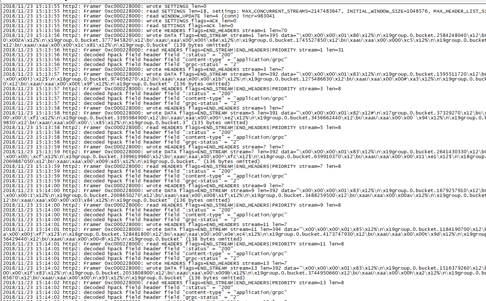

# go中如何开启grpc的trace来debug

grpc是基于http2.0的，设置以下环境变量：

````shell
export GRPC_TRACE=all
export GRPC_VERBOSITY=DEBUG
GODEBUG=http2debug=2
````
设置后，grpc会以日志的形式，输出各组件的详细工作情况，包括报文何如组装，数据如何序列化，收到的报文
等等，碰到grpc疑难杂症时，可以用该方法debug。

grpc trace 日志



**参考连接**
1.  [https://github.com/grpc/grpc/blob/master/doc/environment_variables.md](https://github.com/grpc/grpc/blob/master/doc/environment_variables.md)
1.  [https://stackoverflow.com/questions/37125975/how-to-debug-grpc-call](https://stackoverflow.com/questions/37125975/how-to-debug-grpc-call)