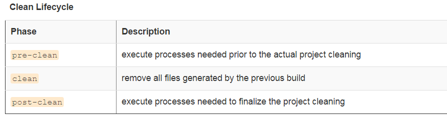
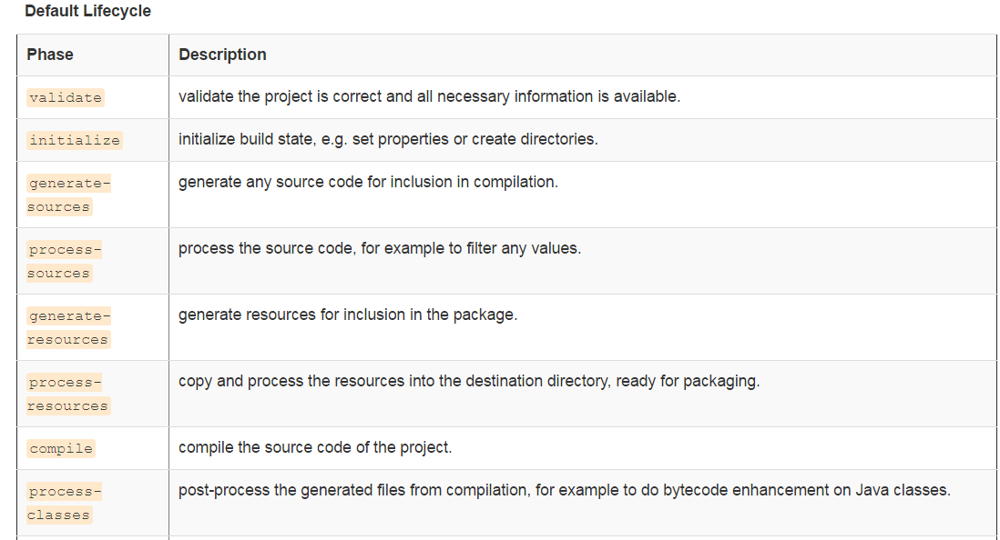
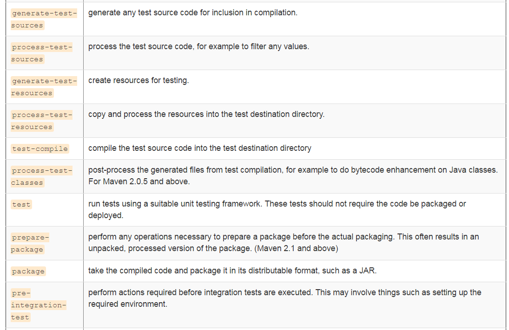
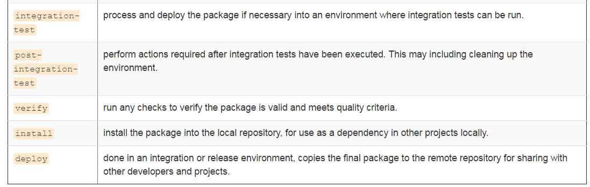
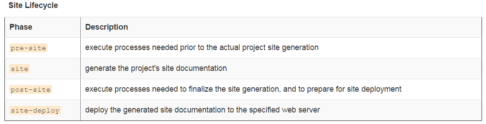
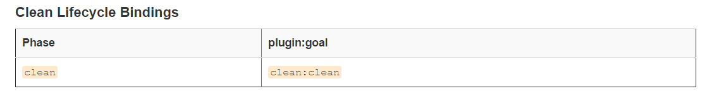
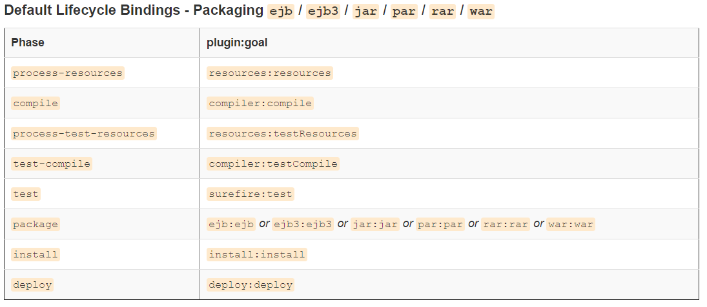
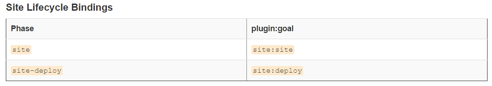

# maven 入门

maven是一种java工程的构建、打包工具，具有自动化、灵活、可扩展等优秀特点，能够一次构建一个
或者多个java项目，很多开源java项目采用maven构建。

## 核心概念

### Artifact

在maven中，一个项目称之为artifact，artifact拥有{groupId, artifaceId, version}三个属性，
这三个属性都是字符串， 比如，一个叫做app的项目，其artifact属性为{"com.my.company", "myApp", "1.0.0"},
当你的项目发布到maven仓库中后，别人就可以使用artifact的这三个属性，来引用你的项目，当然你也可用通过
artifact来引用别人的项目。通过artifact的三属性就可以唯一的确定一个artifact，便于artifact之间相互引用。

### Build Lifecycle & Phase

构建过程称为build lifecycle， 在maven中有三种build lifecycle：default、clean、site， 其中default用于构建
用户定义的对象， clean用于清除构建过程中生成的文件，site用于生成项目文档。phase表示构成过程中的步骤，一个build
lifecycle由一个和多个**有序**的phase构成，当执行某一个phase时，会顺序执行该phase前面所有的phase，然后才执行该
phase，除非某一个phase失败。三种build lifecycle包含的phase如下：

### Goal & Plugin 

phase定义了构建过程中的步骤，而这些步骤的具体实现者叫Goal，相当于phase定义了一个接口，而goal则是接口的实现者，每个
phase都绑定了一个或者多个goal，plugin是多个goal的集合，goal能独立运行，使用plugin:goal的形式应用，例如：*mvn 
dependency:copy-dependencies*， 则是运行dependency这个plugin中的copy-dependencies，该goal用于打包项目的所有
依赖，这种架构使maven拥有极高的可扩展性，我们可以改写phase绑定的goal，是maven能够构建任何我们想要的东西。默认下
每个phase都有绑定的goal，这些goal是构建java项目的，如下：

### POM

